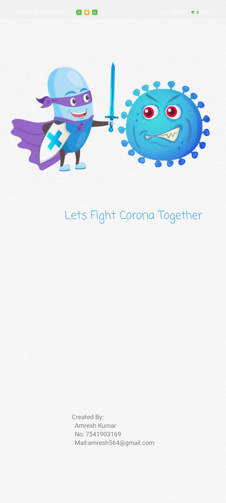
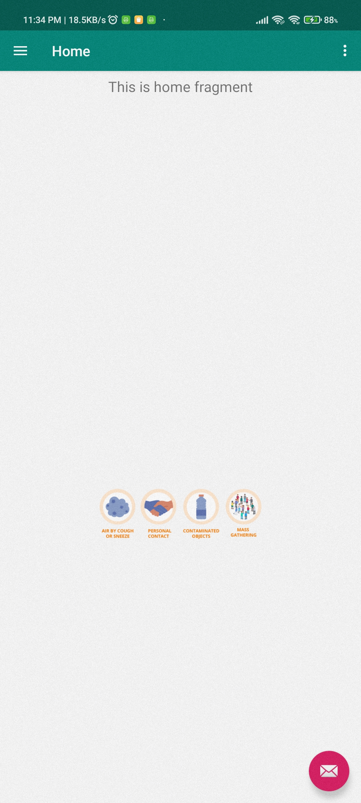
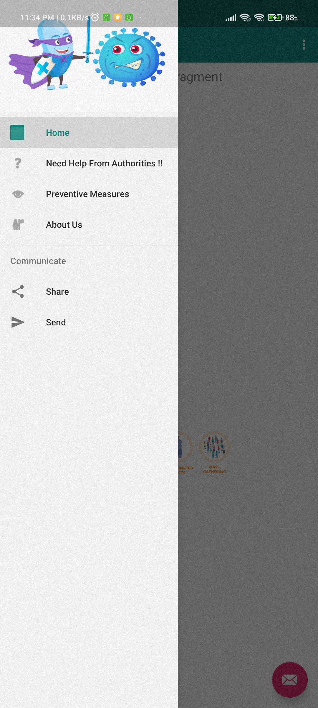

# Corona-Info  
Android Application which shows information regarding Corona
## Here are Some Images of App

  
  
  

## Why ?

Learned about various UI elements in andriod. Specially about Fragments and how to work with them. 

## What Next ?
Working on making it more user-friendly and adding more features, as well as improving the repository section, which isn't yet fully implemented yet as well as adding functionality to share information to the wall(kind of Social Media).

## Issues and Suggestions
Open to feedback and suggestions amresh564@gmail.com
